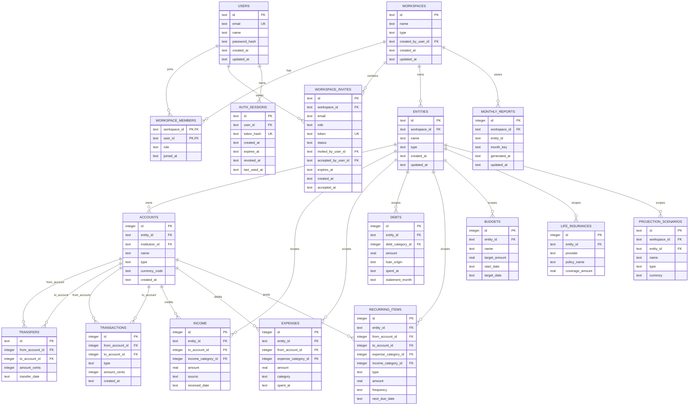

# ERD

This ERD focuses on the active ownership and finance relationships after the
workspace layer was introduced.

## Scoping Notes

- Most finance tables remain safely scoped through `entity_id`.
- Modern transfers and transactions remain safely scoped through account ownership.
- `monthly_reports` now stores `workspace_id` because all-entities monthly reports cannot be derived safely from `entity_id` alone.
- `projection_scenarios` already use `workspace_id`.
